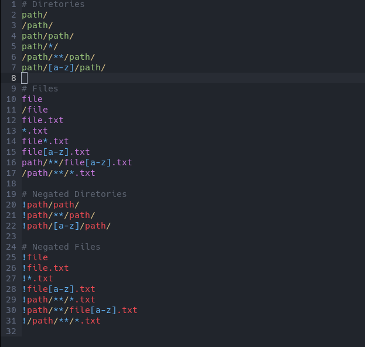

# Ignore files - Plugin for [micro editor](https://micro-editor.github.io)

Adds syntax highlighting to 'ignore' files.

###### Based on [atom language ignore](https://github.com/ldez/atom-language-ignore)



## Supported files

- `.gitignore`: references [gitignore](https://git-scm.com/docs/gitignore) and [Ignoring-Files](https://git-scm.com/book/en/v2/Git-Basics-Recording-Changes-to-the-Repository#Ignoring-Files)
- `.npmignore`: works just like a `.gitignore` [references](https://docs.npmjs.com/misc/developers#keeping-files-out-of-your-package)
- `.dockerignore` : works just like a `.gitignore` [references](https://docs.docker.com/engine/reference/builder/#dockerignore-file)
- `.coffeelintignore`: works just like a `.gitignore`.
- `.slugignore`: does not support negated `!` patterns. [Heroku - Slug Compiler](https://devcenter.heroku.com/articles/slug-compiler#ignoring-files-with-slugignore)
- `.atomignore`: works just like a `.gitignore`. [tree-ignore](https://atom.io/packages/tree-ignore)
- `.hgignore`: references [hgignore](https://www.mercurial-scm.org/wiki/.hgignore) (currently only glop patterns)
- `.vscodeignore`: works just like a `.gitignore` [references](https://code.visualstudio.com/docs/tools/vscecli#_advance-usage)
- `.eslintignore`:  works just like a `.gitignore` [references](https://eslint.org/docs/user-guide/configuring#ignoring-files-and-directories)
- `.prettierignore`:  works just like a `.gitignore` [references](https://prettier.io/docs/en/ignore.html#ignoring-files)

## Installations

### Settings
Add this repo as a **pluginrepos** option in the **~/.config/micro/settings.json** file (it is necessary to restart the micro after this change):
```json
{
  "pluginrepos": [
      "https://gitlab.com/taconi/micro-language-ignore/-/raw/main/repo.json"
  ]
}
```

### Install
In your micro editor press **Ctrl-e** and run command:
```
> plugin install language_ignore
```
or run in your shell
```sh
micro -plugin install language_ignore
```
